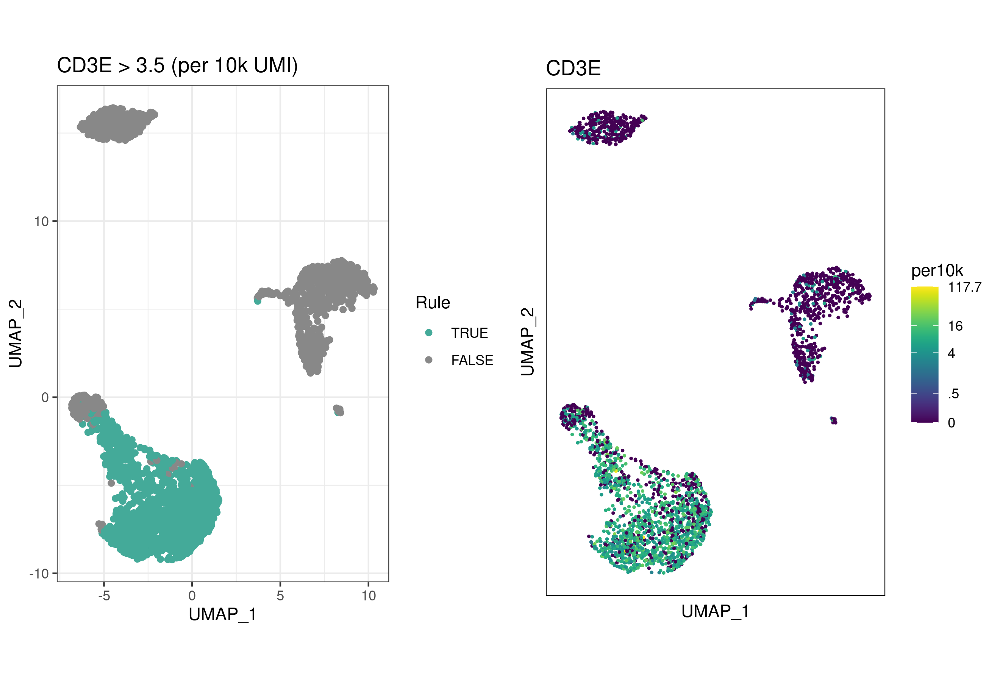

cellpypes – Cell type pipes for R
================

-   [Purpose](#purpose)
-   [Installation](#installation)
-   [Quick start](#quick-start)
-   [Annotating PBMCs](#annotating-pbmcs)
-   [Differential expression testing](#differential-expression-testing)
    -   [Pipe into DESeq2 for differential
        expression](#pipe-into-deseq2-for-differential-expression)
    -   [Pseudobulk matrix](#pseudobulk-matrix)

<!-- README.md is generated from README.Rmd. Please edit that file -->

# Purpose

<!-- badges: start -->
<!-- badges: end -->

With cellpypes, you can quickly construct simple and clear cell type
hierarchies with marker gene rules and the popular piping operator
`%>%`. The goal of cellpypes is to make manual cell type assignments of
single-cell RNAseq data convenient, clear and reproducible. It is
intended for UMI data (10x and SMARTseq3, not SMARTseq2 protocol).

# Installation

Install cellpypes with the following commands:
<!-- You can install the released version of cellpypes from [CRAN](https://CRAN.R-project.org) with: -->
<!-- ``` r --> <!-- install.packages("cellpypes") --> <!-- ``` -->

``` r
# install.packages("devtools")
devtools::install_github("FelixTheStudent/cellpypes")
```

# Quick start

Let’s classify T cells in your `seurat_object`, by requiring high CD3E
expression:

``` r
library(tidyverse)
library(cellpypes)
seurat_object %>%
  pype_from_seurat() %>%
  rule("CD3E+ T cells", "CD3E", ">", 3.5) %>%
  plot_last()
```



As we can see, the chosen threshold of `3.5e-4` results in good
agreement between positive cells (left plot) and high marker gene
expression (right plot). The threshold is given as a fraction of total
library size (total UMI counts), in this case 3.5 UMIs per ten thousand
UMIs. Intuitively, cellpypes judges if the expression in a cell’s
neighborhood is larger than that threshold, taking the uncertainty due
to technical noise into account. The cell’s neighborhood consists of its
nearest neighbors, which are typically transcriptionally similar. Thus,
cellpypes defines CD3E-positive cells as those that that are virtually
indistinguishable from highly-expressing cells, at the given
signal-to-noise ratio.

# Annotating PBMCs

Here, we annote the same PBMC data set as in the popular [Seurat
tutorial](https://satijalab.org/seurat/articles/pbmc3k_tutorial.html),
using the Seurat object `pbmc` that comes out of it.

``` r
library(cellpypes)
library(tidyverse) # provides piping operator %>%

pype <- pype_from_seurat(pbmc)

pype <- pype %>%
  rule("B",           "MS4A1",   ">", 1)                    %>%
  rule("CD14+ Mono",  "CD14",    ">", 1)                    %>%
  rule("CD14+ Mono",  "LYZ",     ">", 20)                   %>%
  rule("FCGR3A+ Mono","MS4A7",   ">", 2)                    %>%
  rule("NK",          "GNLY",    ">", 75)                   %>%
  rule("DC",          "FCER1A",  ">", 1)                    %>%
  rule("Platelet",    "PPBP",    ">", 30)                   %>%
  rule("T",           "CD3E",    ">", 3.5)                  %>% 
  rule("CD8+ T",      "CD8A",    ">", .8,  parent="T")      %>%
  rule("CD4+ T",      "CD4",     ">", .05, parent="T")      %>%
  rule("Naive CD4+",  "CCR7",    ">", 1.5, parent="CD4+ T") %>%
  rule("Memory CD4+",  "S100A4", ">", 13,  parent="CD4+ T")

plot_classes(pype)+ggtitle("PBMCs annotated with cellpypes")
```


A few observations:

-   Note how `rule`’s `parent` argument is used to build a hierarchy.
-   A cell type can have multiple rules, such as `CD14+ Mono`. Only
    cells for which all relevant rules apply are counted to this cell
    type.
-   cellpypes works with **classes** defined by gene-based **rules**.
    Whether your classes correspond to biologically relevant **cell
    types** is best answered in a passionate discussion on their marker
    genes you would have with your peers. Until you are sure, “MS4A1+”
    is a better class name than “B cell”.
-   Unassigned cells (grey) are not necessarily bad but a way to respect
    the signal-to-noise limit. Unassigned cells arise for two reasons:
    -   Not enough signal for any rule to apply. For example, outlier
        cells typically get few neighbors in Seurat’s SNN graph, making
        them negative for most rules.
    -   Not enough separation. If two classes are highly similar, such
        as CD4+ and CD8+ T cells, cells in the noisy class border may be
        positive for rules from both classes. By default, cellpypes sets
        them to `Unassigned`, but this behaviour can be controlled with
        the `replace_overlap_with` argument in `classify` and
        `plot_classes`.
-   There are Naive CD8+ T cells amongst the naive CD4 cells. While
    overlooked in the original tutorial, the marker-based nature of
    cellpypes revealed this. This is a good example for *cellpype*’s
    resolution limit: If UMAP cannot separate cells properly, cellpypes
    will also struggle – but at least it will be obvious. In practice,
    one would re-cluster the T cells and try to separate naive CD8+ from
    naive CD4+, or train a specialized machine learning algorithm to
    discriminate these two cell types in particular.

# Differential expression testing

Differential expression (DE) in the following refers to comparing
multiple samples (patients/mice/…) from at least two different groups
(control/treated/…). We note this is conceptually sound, while DE
between clusters is circular and results in invalid p-values (which are
useful for ranking marker genes, not for determining significance).

This section shows how to sum cells to pseudobulks, followed by testing
with DESeq2. Pseudobulk approaches have been shown to perform as
advertised, while many single-cell methods do not adjust p-values
correctly and fail to control the false-discovery rate.

## Pipe into DESeq2 for differential expression

All you need is a cellpypes object and a `data.frame` with meta data
(patient, treatment, etc.). To demonstrate, let’s make up patients and
treatment for the pbmc Seurat object (generate it yourself by following
[this
tutorial](https://satijalab.org/seurat/articles/pbmc3k_tutorial.html),

``` r
# This dummy example again uses the pbmc object from the Seurat tutorial:
pype <- pbmc %>% 
  pype_from_seurat() %>%
  rule("T", "CD3E", ">", 3.5)  
# To demonstrate, we make up meta data (patient and treatment) for each cell:
set.seed(42)
dummy_variable <- function(x) factor(sample(x, ncol(pbmc), replace=TRUE))
pbmc_meta <- data.frame(
  patient   = dummy_variable(paste0("patient", 1:6)),
  treatment = dummy_variable(c("control","treated")))
rownames(pbmc_meta) <- colnames(pbmc)
head(pbmc_meta)
#>                   patient treatment
#> AAACATACAACCAC-1 patient1   treated
#> AAACATTGAGCTAC-1 patient5   treated
#> AAACATTGATCAGC-1 patient1   control
#> AAACCGTGCTTCCG-1 patient1   treated
#> AAACCGTGTATGCG-1 patient2   treated
#> AAACGCACTGGTAC-1 patient4   control
```

With cellpypes, you can directly pipe a given cell type into DESeq2 to
create a DESeq2 DataSet (dds) and test it:

``` r
library(DESeq2)
dds <- pype %>% 
  class_to_deseq2(pbmc_meta, "T", ~ treatment)
# test for differential expression and get DE genes:
dds <- DESeq(dds)
data.frame(results(dds)) %>% arrange(padj)
```

In this dummy example, there is no real DE to find because we assigned
cells randomly to treated/control.

## Pseudobulk matrix

If you prefer to compute the full pseudobulk matrix with all cell types,
here is a fully-reproducible minimal example. The crucial command is
`pseudobulk(counts, pseudobulk_id(meta_df))`, where counts and meta\_df
can be easily obtained from a seurat object like this:

-   counts could be `seurat@assays$RNA@counts`
-   meta\_df could be selected columns from `seurat@meta.data`

For a Seurat-independent demonstration, I will simulate raw UMI counts
and associated meta data:

``` r
# simulate dummy UMI counts (all genes have same expression):
ncell=1000; ngene=100
counts <- matrix(rpois(ngene*ncell, 0.5),
                 nrow=ngene, ncol=ncell,
                 dimnames = list(paste0("gene", 1:ngene),
                                 paste0("cell", 1:ncell)))
# simulate meta data (two cell types, each patient has control and treatment)
dummy_variable <- function(x) factor(sample(x, ncell, replace=TRUE))
meta_df <- data.frame(
  patient  =dummy_variable(paste0("patient", 1:6)),
  condition=dummy_variable(c("control", "treated")),
  celltype =dummy_variable(c("Tcell", "Bcell"))
)
head(meta_df)
#>    patient condition celltype
#> 1 patient2   control    Tcell
#> 2 patient5   treated    Bcell
#> 3 patient3   control    Tcell
#> 4 patient5   treated    Bcell
#> 5 patient5   control    Bcell
#> 6 patient1   control    Tcell
```

We aggregate single-cell counts to pseudobulks, and single-cell meta
data to coldat (coldat=data on every column in the pseudobulk matrix):

``` r
library(tidyverse)
bulks <- pseudobulk(counts, pseudobulk_id(meta_df))
coldat<-meta_df %>% distinct %>%
  mutate(ID=pseudobulk_id(.)) %>% column_to_rownames("ID")
# bring to same order (good practice and required for DESeq2)
coldat <- coldat[colnames(bulks), ]  
```

After constructing the DESeq2 data set (dds), we can compute
differentially expressed genes:

``` r
library(DESeq2)
dds <- DESeqDataSetFromMatrix(countData = bulks,
                              colData = coldat,
                              design = ~ condition)
dds <- DESeq(dds)
results(dds)
```
