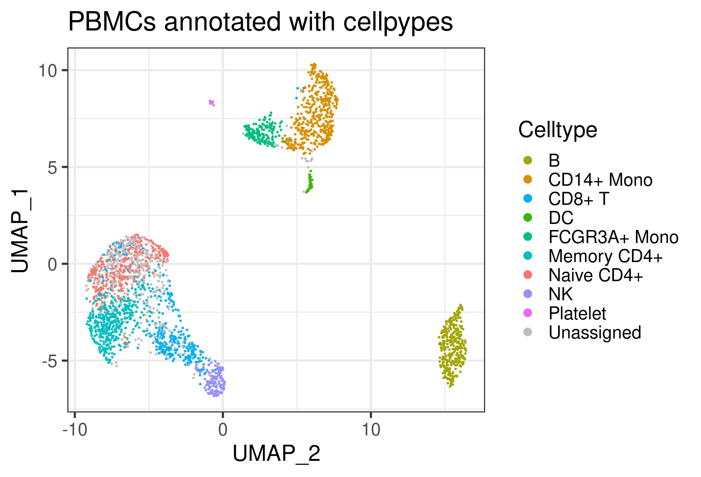

<!-- README.md is generated from README.Rmd. Please edit that file -->

# cellpypes

<!-- badges: start -->
<!-- badges: end -->

The goal of cellpypes is to …

## Installation

Install *cellpypes* with the following commands:
<!-- You can install the released version of cellpypes from [CRAN](https://CRAN.R-project.org) with: -->
<!-- ``` r --> <!-- install.packages("cellpypes") --> <!-- ``` -->

``` r
# install.packages("devtools")
devtools::install_github("FelixTheStudent/cellpypes")
```

## Quick start

## Annotating PBMCs

Here, we annote the same PBMC data set as in the popular [Seurat
tutorial](https://satijalab.org/seurat/articles/pbmc3k_tutorial.html),
using the Seurat object `pbmc` that comes out of it.

``` r
library(cellpypes)
library(tidyverse) # provides piping operator %>%

pype <- pype_from_seurat(pbmc)

pype <- pype %>%
  rule("B",           "MS4A1",   ">", 1e-4)                    %>%
  rule("CD14+ Mono",  "CD14",    ">", 1e-4)                    %>%
  rule("CD14+ Mono",  "LYZ",     ">", 20e-4)                   %>%
  rule("FCGR3A+ Mono","MS4A7",   ">", 2e-4)                    %>%
  rule("NK",          "GNLY",    ">", 75e-4)                   %>%
  rule("DC",          "FCER1A",  ">", 1e-4)                    %>%
  rule("Platelet",    "PPBP",    ">", 30e-4)                   %>%
  rule("T",           "CD3E",    ">", 3.5e-4)                  %>% 
  rule("CD8+ T",      "CD8A",    ">", .8e-4,  parent="T")      %>%
  rule("CD4+ T",      "CD4",     ">", .05e-4, parent="T")      %>%
  rule("Naive CD4+",  "CCR7",    ">", 1.5e-4, parent="CD4+ T") %>%
  rule("Memory CD4+",  "S100A4", ">", 13e-4,  parent="CD4+ T")

pype %>% plot_classes
```



A few observations:

-   *cellpypes* works with **classes** defined by gene-based **rules**.
    Whether your classes correspond to biologically relevant **cell
    types** is best answered in a passionate discussion on their marker
    genes you would have with your peers. Until you are sure, “MS4A1+”
    is a better class name than “B cell”.
-   Note how `rule`’s *parent* argument is used to build a hierarchy.
-   Unassigned cells (grey) can arise for multiple reasons:
    -   Not enough signal for any rule to apply. For example, outlier
        cells typically get few neighbors in Seurat’s SNN graph, making
        them negative for most rules.
    -   Not enough separation. If two classes are highly similar, such
        as CD4+ and CD8+ T cells, cells in the noisy class border may be
        positive for rules from both classes. By default, *cellpypes*
        sets them to *Unassigned*, but this behaviour can be controlled
        with the *replace\_overlap\_with* argument in `classify` and
        `plot_classes`.
-   A cell type can have multiple rules, as the above example shows for
    CD14+ Monocytes. Only cells for which all rules apply are counted to
    this cell type.
-   There are Naive CD8+ T cells amongst the naive CD4 cells. While
    overlooked in the original tutorial, the marker-based nature of
    *cellpypes* revealed this. This is a good example for *cellpype*’s
    resolution limit: If UMAP cannot separate cells properly,
    *cellpypes* will also struggle – but at least it will be obvious. In
    practice, one would re-cluster the T cells and try to separate naive
    CD8+ from naive CD4+, or train a specialized machine learning
    algorithm to discriminate these two cell types in particular.

## Example

This is a basic example which shows you how to solve a common problem:

``` r
library(cellpypes)
## basic example code
```

# notes to myself

-   execute but hide code: echo=FALSE
-   You’ll still need to render `README.Rmd` regularly, to keep
    `README.md` up-to-date. `devtools::build_readme()` is handy for
    this. You could also use GitHub Actions to re-render `README.Rmd`
    every time you push. An example workflow can be found here:
    <https://github.com/r-lib/actions/tree/master/examples>.
