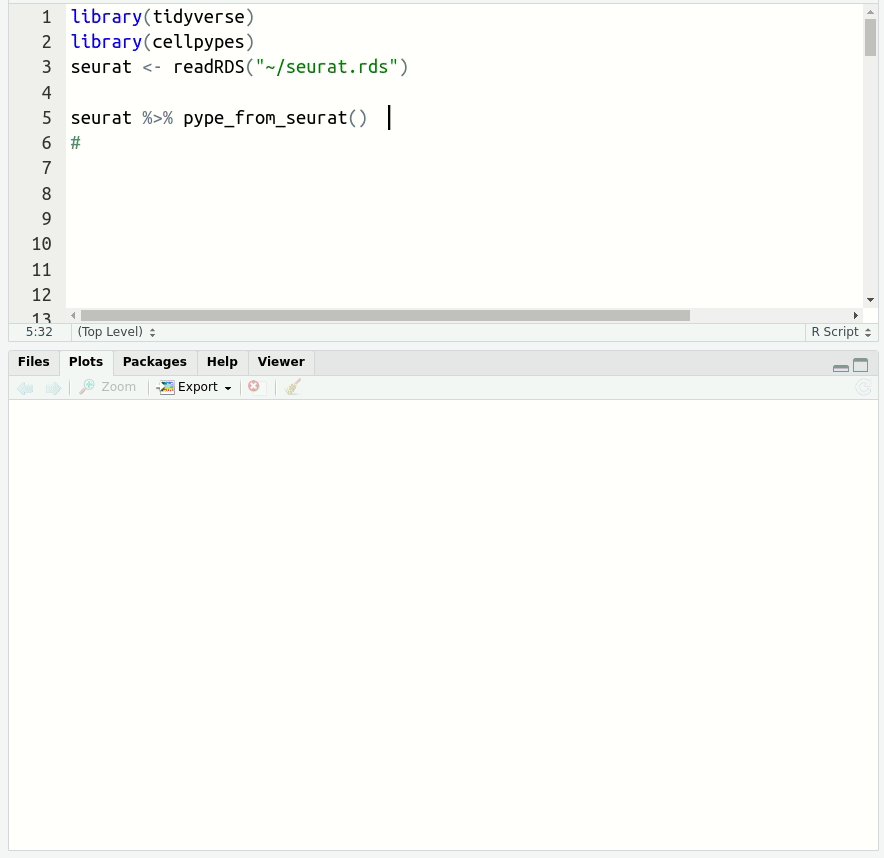

cellpypes – Cell type pipes for R
================

-   [Pipe your types!](#pipe-your-types)
-   [Installation](#installation)
-   [Citation](#citation)
-   [cellpypes input](#cellpypes-input)
-   [List of functions](#list-of-functions)
-   [Annotating PBMCs](#annotating-pbmcs)
-   [Understanding how cellpypes
    works](#understanding-how-cellpypes-works)
-   [Function demos](#function-demos)
-   [FAQ](#faq)

<!-- README.md is generated from README.Rmd. Please edit that file -->
<!-- badges: start -->

[](https://doi.org/10.5281/zenodo.6555728)
<!-- badges: end -->

# Pipe your types!

Cellpypes uses the popular piping operator `%>%` to manually annotate
cell types in single-cell RNA sequencing data. It can be applied to UMI
data (e.g. 10x Genomics).

Define gene rules interactively:



-   Adjust the threshold until the selected cells agree well with marker
    gene expression.
-   Use positive (CD3E+) and negative (MS4A1-) markers to annotate any
    subpopulation of interest.
-   Explore with `feat`, select with `rule`, visualize with `plot_last`
    or `plot_classes` and get cell type labels with `classify`.

Resolve detailed cell type subsets. Switch between cell type hierarchy
levels in your analysis:


# Installation

Install cellpypes with the following commands:
<!-- You can install the released version of cellpypes from [CRAN](https://CRAN.R-project.org) with: -->
<!-- ``` r --> <!-- install.packages("cellpypes") --> <!-- ``` -->

``` r
# install.packages("devtools")
devtools::install_github("FelixTheStudent/cellpypes")
```

# Citation

To cite cellpypes, download your favorite citation style from
[zenodo](https://zenodo.org/record/6555728#.YoNNl1xBxH4), type
`citation("cellpypes")` in R or simply use:

> Frauhammer, Felix, & Anders, Simon. (2022). cellpypes: Cell Type Pipes
> for R (0.1.1). Zenodo. <https://doi.org/10.5281/zenodo.6555728>

# cellpypes input

cellpypes input has four slots:

-   `raw`: (sparse) matrix with genes in rows, cells in columns
-   `totalUMI`: the colSums of obj$raw
-   `embed`: two-dimensional embedding of the cells, provided as
    data.frame or tibble with two columns and one row per cell.
-   `neighbors`: index matrix with one row per cell and k-nearest
    neighbor indices in columns. We recommend k=50, but generally
    15&lt;k&lt;100 works well. Here are two ways to get the `neighbors`
    index matrix:
    -   Use `find_knn(featureMatrix)$idx`, where featureMatrix could be
        principal components, latent variables or normalized genes
        (features in rows, cells in columns).
    -   use `as(seurat@graphs[["RNA_nn"]], "dgCMatrix")>.1` to extract
        the kNN graph computed on RNA. This also works with RNA\_snn,
        wknn/wsnn or any other available graph – check with
        `names(seurat@graphs)`.

Examples for cellpypes input:

``` r
# Object from scratch:
obj <- list(
  raw = counts,              # raw UMI, cells in columns
  neighbors = knn_ids,       # neighbor indices, cells in rows, k columns
  embed = umap,              # 2D embedding, cells in rows
  totalUMI = library_sizes   # colSums of raw, one value per cell
)

# Object from Seurat:
obj <- list(
   list(
    raw      =SeuratObject::GetAssayData(seurat, "counts"),
    neighbors=as(seurat@graphs[["RNA_nn"]], "dgCMatrix")>.1, # sometims "wknn"
    embed    =FetchData(seurat, dimension_names),
    totalUMI = seurat$nCount_RNA
  ) 
)

# Object from Seurat (experimental short-cut):
obj <- pype_from_seurat(seurat_object)
```

# List of functions

Functions for manual classification:

-   `feat`: feature plot (UMAP colored by gene expression)
-   `rule`: add a cell type rule
-   `plot_last`: plot the most recent rule or class
-   `classify`: classify cells by evaluating cell type rules
-   `plot_classes`: call and visualize `classify`

Functions for pseudobulking and differential gene expression (DE)
analysis:

-   `class_to_deseq2`: Create DESeq2 object for a given cell type
-   `pseudobulk`: Form pseudobulks from single-cells
-   `pseudobulk_id`: Generate unique IDs to identify pseudobulks

# Annotating PBMCs

Here, we annotate the same PBMC data set as in the popular [Seurat
tutorial](https://satijalab.org/seurat/articles/pbmc3k_tutorial.html),
using the Seurat object `seurat_object` that comes out of it.

``` r
library(cellpypes)
library(tidyverse) # provides piping operator %>%


pype <- seurat_object %>%
  pype_from_seurat %>%
  rule("B",           "MS4A1",   ">", 1)                    %>%
  rule("CD14+ Mono",  "CD14",    ">", 1)                    %>%
  rule("CD14+ Mono",  "LYZ",     ">", 20)                   %>%
  rule("FCGR3A+ Mono","MS4A7",   ">", 2)                    %>%
  rule("NK",          "GNLY",    ">", 75)                   %>%
  rule("DC",          "FCER1A",  ">", 1)                    %>%
  rule("Platelet",    "PPBP",    ">", 30)                   %>%
  rule("T",           "CD3E",    ">", 3.5)                  %>% 
  rule("CD8+ T",      "CD8A",    ">", .8,  parent="T")      %>%
  rule("CD4+ T",      "CD4",     ">", .05, parent="T")      %>%
  rule("Naive CD4+",  "CCR7",    ">", 1.5, parent="CD4+ T") %>%
  rule("Memory CD4+",  "S100A4", ">", 13,  parent="CD4+ T")

plot_classes(pype)+ggtitle("PBMCs annotated with cellpypes")
```


All major cell types are annotated with cell pypes. Note how there are
naive CD8+ T cells among the naive CD4 cells. While overlooked in the
[original
tutorial](https://satijalab.org/seurat/articles/pbmc3k_tutorial.html),
the marker-based nature of cellpypes revealed this. This is a good
example for *cellpype*’s resolution limit: If UMAP cannot separate cells
properly, cellpypes will also struggle – but at least it will be
obvious. In practice, one would re-cluster the T cells and try to
separate naive CD8+ from naive CD4+, or train a specialized machine
learning algorithm to discriminate these two cell types in particular.

# Understanding how cellpypes works

cellpypes works with **classes** defined by gene-based rules.

> Whether your classes correspond to biologically relevant **cell
> types** is best answered in a passionate discussion on their marker
> genes you should have with your peers.

Until you are sure, “MS4A1+” is a better class name than “B cell”.

### CP10K measure UMI fractions

cellpypes uses CP10K (counts per 10 thousand) in functions `rule` and
`feat`. This is why and what that means:

-   For marker genes, CP10K typically lie in the human-friendly range
    between 0.1 and 10 CP10K.
-   A typical mammalian cell can be expected to have around 10K UMIs in
    total ([100K
    mRNAs](http://book.bionumbers.org/how-many-mrnas-are-in-a-cell/)
    captured with [10 % conversion
    rate](https://kb.10xgenomics.com/hc/en-us/articles/360001539051-What-fraction-of-mRNA-transcripts-are-captured-per-cell-)),
    so 1 CP10K means roughly 1 UMI in a typical cell.
-   If one out of 10 thousand mRNA molecules in cells originated from
    CD3E, then we’d expect to observe 1 CP10K in our UMI count matrix.
    In reality, there is technical noise, so we might see 1 CP10K in
    some cells and other values in others – but by design, UMI fractions
    and mRNA fractions are highly correlated!
-   CP10K are a noisy estimate of mRNA fractions. Cellpypes models this
    uncertainty during manual thresholding by considering the UMI counts
    of nearest neighbor cells as well. When deciding if cells are
    positive (or negative) for a marker gene, the functions `classify`,
    `plot_last` and `plot_classes` leave cells unassigned if there was
    not enough evidence.

### Intuition behind cell pypes

> cellpypes compares the expression of a cell and its nearest neighbors
> to a user-provided threshold, taking the uncertainty due to technical
> noise into account.

cellpypes assumes a cell’s nearest neighbors are transcriptionally
highly similar, so that the technical noise dominates the biological
variation. This means that the UMI counts for a given marker gene, say
CD3E, came from cells that roughly had the same fraction of CD3E mRNA.
We can not use this reasoning to infer the individual cell’s mRNA
fraction reliably (which is why [imputation introduces
artifacts](https://f1000research.com/articles/7-1740)), but we can
decide with reasonable confidence whether this cell was at least part of
a subpopulation in which many cells expressed this gene highly. In other
words:

> In cellpypes logic, CD3E+ cells are virtually indistinguishable from
> cells with high CD3E expression. We just can’t prove they all had CD3E
> mRNA due to data sparsity.

### Math/statistics behind cellpypes

-   cellpypes models UMI counts as Poisson random variable, which
    approximates the negative binomial distribution for small expression
    strengths and [appears to fit single-cell data
    well](https://genomebiology.biomedcentral.com/articles/10.1186/s13059-019-1861-6).
-   The marker gene UMI counts are summed up across a cell and its
    neighbors, forming the pooled counts `K`.
-   Summation allows cellpypes to use the Poisson distribution when
    comparing expression `K` with the user-provided threshold `t`,
    because [the sum across Poisson random variables is again a Poisson
    random
    variable](https://en.wikipedia.org/wiki/Poisson_distribution#Sums_of_Poisson-distributed_random_variables).
-   cellpypes checks if the summed counts `K` are likely to have come
    from a Poisson distribution with rate parameter `t*S`, where `t` is
    the CP10K threshold supplied through the `rule` function, and `S` is
    the sum of totalUMI counts from the cell and its neighbors. If it is
    very likely, the counts are too close to the threshold to decide and
    the cell is left unassigned. If `K` lies above the expectancy `t*S`,
    the cell is marked as positive, if below, it is marked as negative
    for the given marker gene.
-   The threshold `t` is chosen such that it separates positive from
    negative cells, so will typically lie directly between these two
    populations. This means that the above procedure should not be
    considered a hypothesis test, because `t` is picked deliberately to
    make the null hypothesis (H0: `K` came from `Pois(t*S)`) unlikely.
-   Instead, cellpypes is a tool to quantify uncertainty around the
    threshold `t`. If cells were sequenced deeply, `S` becomes larger,
    which means we have more information to decide.

# Function demos

The following has a short demo of every function. Let’s say you have
completed the [Seurat pbmc2700
tutorial](https://satijalab.org/seurat/articles/pbmc3k_tutorial.html)
(or it’s
[shortcut](https://satijalab.org/seurat/articles/essential_commands.html#seurat-standard-worflow-1)),
then you can start pyping from this `pbmc` object:

``` r
pbmc <- pype_from_seurat(seurat_object)
```

### feat

Visualize marker gene expression with `feat` (short for feature plot):

``` r
pbmc %>% 
  feat(c("NKG7", "MS4A1"))
```


-   The [viridis color
    scale](https://CRAN.R-project.org/package=viridis) is used because
    it encodes higher expression with higher color intensity, and is
    robust to colorblindness.
-   Default UMAP setting produce crowded embeddings. To avoid
    overplotting, we recommend playing with UMAP’s `min_dist` and
    `spread` parameters. Compute UMAP with `spread`=5 and you’ll be able
    to see much more in your embeddings!
-   Manual thresholding is easier if you know whether your gene is
    expressed highly or lowly. In above example, I’d start with a large
    threshold for NKG7 (e.g. 10 CP10K) and a moderate one for MS4A1
    (e.g. 1 CP10K), simply because NKG7 goes up to 381 CP10K in some
    cells.

### rule and plot\_last

Create a few cell type `rule`s and plot the most recent one with
`plot_last`:

``` r
pbmc %>%
  rule("CD14+ Mono",  "CD14",    ">", 1)                    %>%
  rule("CD14+ Mono",  "LYZ",     ">", 20)                   %>%
  # uncomment this line to have a look at the LYZ+ rule:
  # plot_last()   
  rule("Tcell",       "CD3E",    ">", 3.5)                  %>% 
  rule("CD8+ T",      "CD8A",    ">", 1,  parent="Tcell")   %>%
  plot_last()
```


-   The `plot_last` function plots the last rule you have added to the
    object. You can move it between any of the above lines to look at
    the preceding rule, as indicated by the commented `plot_last` call
    above.
-   Try lower and higher thresholds, until there is good agreement
    between positive cells (left plot) and high marker gene expression
    (right plot).
-   cellpypes classes (aka cell types) can have as many rules as you
    want. CD14+ monocytes have two in this example.
-   You can build hierarchy with the `parent` argument, to arbitrary
    depths. In this example, CD8+ T cells are `CD3E+CD8A+`, not just
    `CD8A+`, because their ancestor `Tcell` had a rule for CD3E.
-   Above code chunk is a neat way to document your cell type
    assignment. You can generate a template with neat text alignment
    with `pype_code_template()`.

### classify and plot\_classes

Get cell type labels with `classify` or plot them directly with
`plot_classes` (which wraps ggplot2 code around `classify`):

``` r
# rules for several cell types:
pbmc2 <- pbmc %>%
  rule("Bcell",       "MS4A1",   ">", 1)                    %>%
  rule("CD14+ Mono",  "CD14",    ">", 1)                    %>%
  rule("CD14+ Mono",  "LYZ",     ">", 20)                   %>%
  rule("Tcell",       "CD3E",    ">", 3.5)                  %>% 
  rule("CD8+ T",      "CD8A",    ">", 1,  parent="Tcell")   

pbmc2 %>% plot_classes()
```


``` r
pbmc2 %>% plot_classes(c("Tcell", "CD8+ T")) + ggtitle("T cells")
```


``` r
head(classify(pbmc2))
#> [1] Unassigned Bcell      Unassigned Unassigned Unassigned Unassigned
#> Levels: Bcell CD14+ Mono CD8+ T Unassigned
```

-   By default, `classify`/`plot_classes` will use all classes at the
    end of the hierarchy. T cells are not plotted in the first example
    because they are not the end, they have a ‘child’ called `CD8+ T`.
    You can still have them in the same plot, by specifically asking for
    `plot_classes(c("Tcell", "CD8+ T"))` (second example).
-   If cell types overlap, `classify` returns `Unassigned` for cells
    with mutually exclusive labels (such as `Tcell` and `Bcell`).
-   For this reason it matters whether you call `classify("Tcell")` or
    `classify(c("Tcell","Bcell")` – the overlap is masked with
    `Unassigned` in this second call, but not in the first.
-   If a cell gets multiple labels but from the same lineage
    (e.g. `Tcell` and `CD8+ T`), the more detailed class is returned
    (`CD8+ T`).

### class\_to\_deseq2

Let’s imagine the PBMC data had multiple patients and treatment
conditions (we made them up here for illustraion):

``` r
head(pbmc_meta)
#>    patient treatment
#> 1 patient1   treated
#> 2 patient5   treated
#> 3 patient1   control
#> 4 patient1   treated
#> 5 patient2   treated
#> 6 patient4   control
```

Every row in `pbmc_meta` corresponds to one cell in the `pbmc` object.

With cellpypes, you can directly pipe a given cell type into DESeq2 to
create a DESeq2 DataSet (dds) and test it:

``` r
library(DESeq2)
dds <- pbmc %>% 
  rule("Bcell",   "MS4A1",   ">", 1)     %>%
  rule("Tcell",   "CD3E",    ">", 3.5)   %>% 
  class_to_deseq2(pbmc_meta, "Tcell", ~ treatment)
#> converting counts to integer mode
# test for differential expression and get DE genes:
dds <- DESeq(dds)
#> estimating size factors
#> estimating dispersions
#> gene-wise dispersion estimates
#> mean-dispersion relationship
#> final dispersion estimates
#> fitting model and testing
data.frame(results(dds)) %>% arrange(padj) %>% head
#>                  baseMean log2FoldChange     lfcSE         stat       pvalue
#> GPS1            8.6843786      1.8672676 0.4857916  3.843762680 0.0001211622
#> YWHAB         103.9834701      0.5056233 0.1303942  3.877651683 0.0001054696
#> AL627309.1      0.2517306     -0.4637681 2.2839665 -0.203053829 0.8390929591
#> AP006222.2      0.1505561      0.0171219 3.1165397  0.005493882 0.9956165384
#> RP11-206L10.2   0.0876921     -0.4637718 3.1165397 -0.148809843 0.8817036838
#> LINC00115       0.5822425      0.4344445 1.5861918  0.273891551 0.7841679649
#>                    padj
#> GPS1          0.8898756
#> YWHAB         0.8898756
#> AL627309.1    0.9998075
#> AP006222.2    0.9998075
#> RP11-206L10.2 0.9998075
#> LINC00115     0.9998075
```

In this dummy example, there is no real DE to find because we assigned
cells randomly to treated/control.

### pseudobulk and pseudobulk\_id

Instead of piping into DESeq2 directly, you can also form pseudobulks
with `pseudobulk` and helper function `pseudobulk_id`. This can be
applied to any single-cell count data, independent from cellpypes. For
example, `counts` could be `seurat@assays$RNA@counts` and `meta_df`
could be selected columns from `seurat@meta.data`.

``` r
pbmc3 <- pbmc %>% rule("Tcell",   "CD3E",    ">", 3.5)
is_class <- classify(pbmc3) == "Tcell" 
counts <- pseudobulk(pbmc$raw[,is_class], 
                     pseudobulk_id(pbmc_meta[is_class,]))
counts[35:37, 1:3]
#> 3 x 3 Matrix of class "dgeMatrix"
#>            patient1.control patient1.treated patient2.control
#> AL645608.1                0                0                0
#> NOC2L                    13                6               16
#> KLHL17                    0                0                0
```

# FAQ

### Should I report bugs?

Yes. Do it. You can [search similar problems or create new issues on
gitHub](https://github.com/FelixTheStudent/cellpypes/issues). If you
want to be nice and like fast help for free, try to provide a [minimal
example](https://en.wikipedia.org/wiki/Minimal_reproducible_example) of
your problem if possible. Make sure to include the version of your
cellpypes installation, obtained e.g. with
`packageVersion("cellpypes")`.

### Why are some cells unassigned?

Unassigned cells (grey) are not necessarily bad but a way to respect the
signal-to-noise limit. Unassigned cells arise for two reasons:

-   Not enough signal for any rule to apply. For example, outlier cells
    typically get few neighbors in Seurat’s SNN graph, making them
    negative for most rules.
-   Not enough separation. If two classes are highly similar, such as
    CD4+ and CD8+ T cell subsets, cells in the noisy class border may be
    positive for rules from both classes. By default, cellpypes sets
    them to `Unassigned`, but this behavior can be controlled with the
    `replace_overlap_with` argument in `classify` and `plot_classes`.

### How is DE different from cluster markers?

In cellpypes logic, Differential Expression (DE) analysis refers to
comparing multiple samples (patients/mice/…) from at least two different
groups (control/treated/…). These so called [multi-condition
multi-sample
comparisons](https://www.nature.com/articles/s41467-020-19894-4) have
individuals, not cells, as unit of replication, and give reliable
p-values.

Finding cluster markers, in contrast, is circular and results in invalid
p-values (which are useful for ranking marker genes, not for determining
significance). The circularity comes from first using gene expression
differences to find clusters, and then testing the null hypothesis that
the same genes have no differences between clusters.

### Why pseudobulks?

Pseudobulk approaches have been shown to perform as advertised, while
many single-cell methods do not adjust p-values correctly and fail to
control the false-discovery rate. Note that DESeq2, however, requires
you to [filter out lowly expressed
genes](https://pubmed.ncbi.nlm.nih.gov/29481549/).
